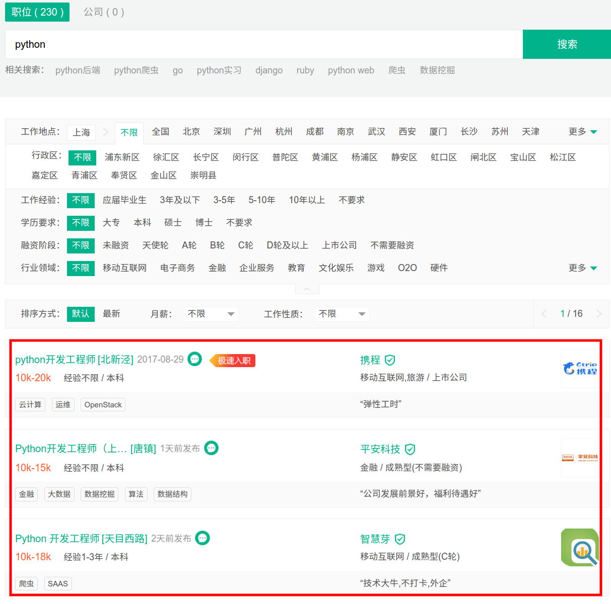
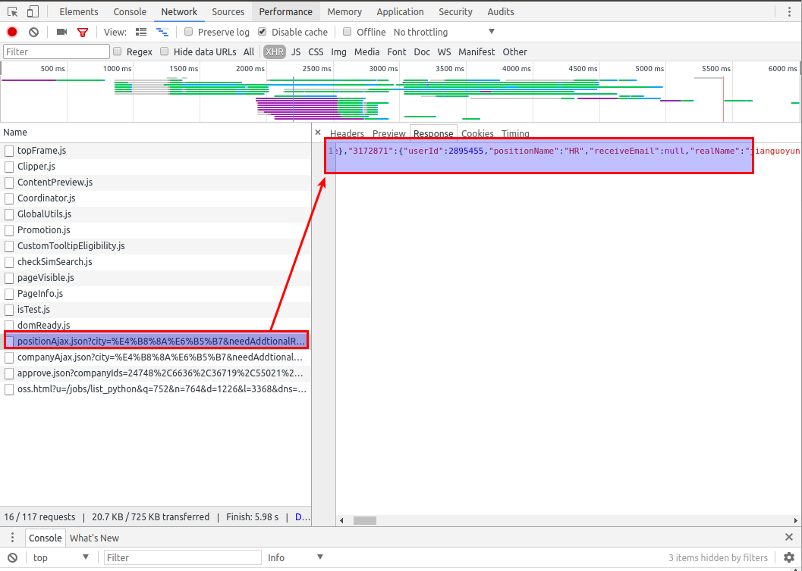
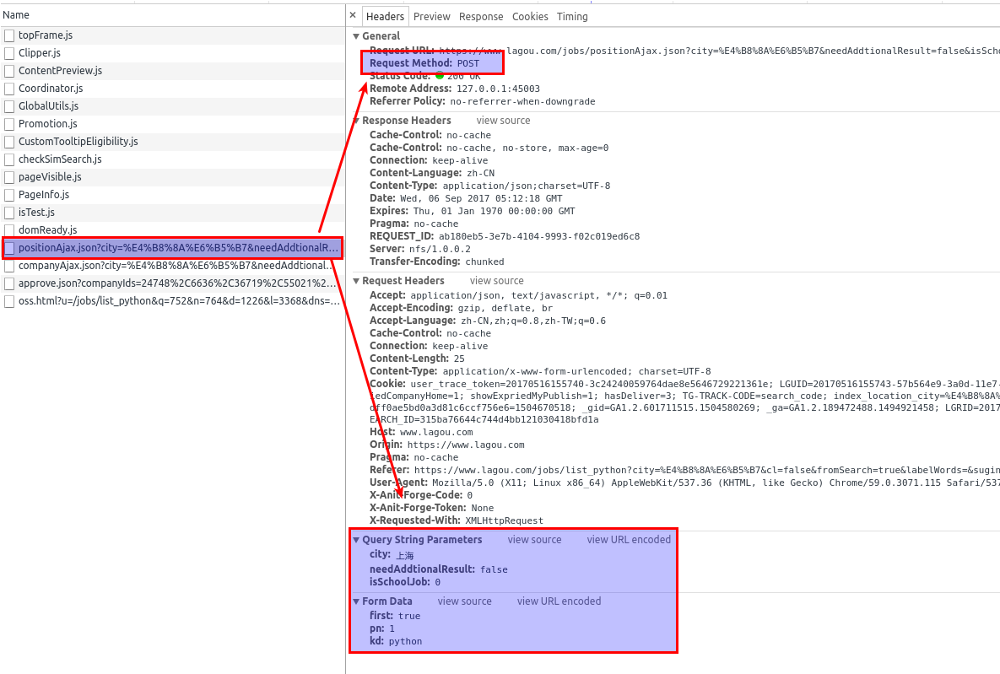
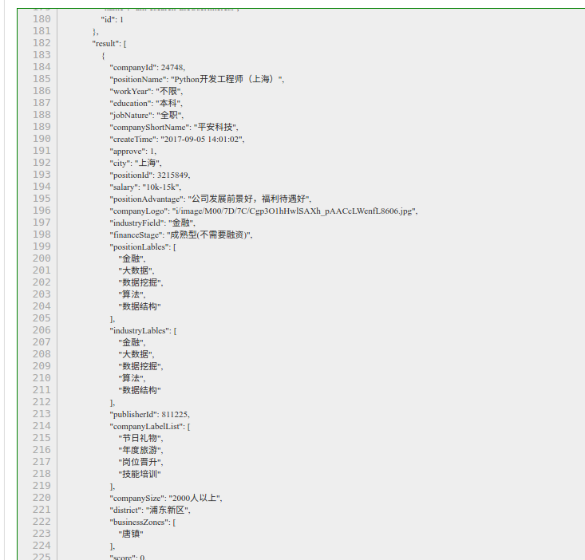

## 爬取招聘网站(二)

在实际的爬取过程中，首先应该用 requests 尝试请求一下网页，在确定好能够爬取之后再使用 scrapy 框架大规模抓取。

#### 文章结构

- 分析拉钩网请求
- 分析需要爬取那些内容


#### 分析网页请求

打开拉勾网，搜索关键字 `python` , 得到以下页面：



可以看到，红框圈起来的内容是我们希望得到的。
作为测试，使用`requests`写一个简单的脚本,来查看请求当前的页面是否会得到该内容。

```python

import requests

url = 'https://www.lagou.com/jobs/list_python%E5%90%8E%E7%AB%AF?\
oquery=Python&fromSearch=true&labelWords=relative&city=%E4%B8%8A%E6%B5%B7'

header = {
    'User-Agent': 'Mozilla/5.0 (X11; Linux x86_64) AppleWebKit/537.36\
        (KHTML, like Gecko) Chrome/59.0.3071.115 Safari/537.36'
}
req = requests.get(url,headers=header)
print(req.text)
```

运行以上代码之后，我们发现所需的内容并没有在响应的内容中，服务器响应了内容，说明并没有拒绝我们的请求，所以初步判断该内容可能是 ajax 加载。

此时，回到浏览器页面，按 F12 启动开发者工具，点击 XHR 查看 ajax 加载请求， 刷新目前的网页之后可以看到一长串内容，这个查看其响应内容。
最后我们发现红框选中这个链接返回了大量的内容，



继续点击查看 headers 内容



到此，请求方法、相应请求参数都显示在页面，模拟该请求试试看。

新的代码

```python

import requests

header = {
    'Referer': 'https://www.lagou.com/jobs/list_python?labelWords=&fromSearch=true&suginput=',
    'User-Agent': 'Mozilla/5.0 (X11; Linux x86_64) AppleWebKit/537.36 (KHTML, like Gecko) Chrome/60.0.3112.101 Safari/537.36'
}

url = 'https://www.lagou.com/jobs/positionAjax.json?city=%E4%B8%8A%E6%B5%B7&needAddtionalResult=false'

dct = {
    'pn': '1',
    'kd': 'python'
}
req = requests.post(url, dct, headers=header)

print(req.text)

```
注意到，我们在 header 中添加了 Referer 参数，这个是经过调试后确定的，最开始我是将 Request Headers 中所有的内容都复制过来，然后多次运行判断之后，发现 Referer 必不可少。
从响应结果来看，这就是我们需要的，如下图所示

小技巧： 直接打印出来的 json 数据没有层级结构，不利于查看分析，在网上有很多在线格式化的工具可供我们使用：

- [在线校检网站](http://www.bejson.com/)
- [编程实验室自制工具](http://lab.crossincode.com/tools/json/)



调试就已经完成了，接下来我们继续分析响应。

#### 分析响应

从返回的信息中，我们可以至少得到以下信息

- 职位名 / positionName
- 工作年限 / workYear
- 学历 / education
- 公司名 / companyShortName
- 城市 / city
- 薪水 / salary
- 行业 / industryField
- 公司性质 / financeStage
- 公司规模 / companySize
- 职位福利 / companyLabelList
- 职位关键词 / positionLables

等等


#### 总结

在本节中，我们展示了如何使用 chrome 开发者工具分析 ajax 请求，在下一节，我们会探讨怎么把 scrapy 连接到数据库上去。
