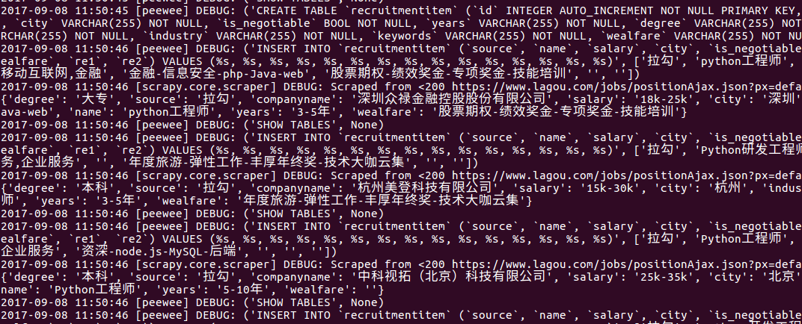
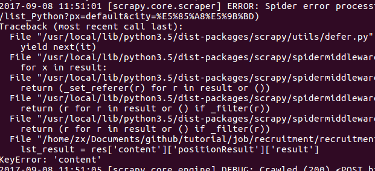
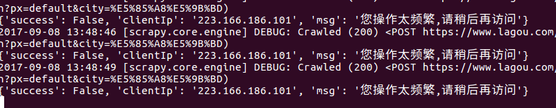

## 爬取招聘网站(四)

#### 文章结构

- 从响应中提取有效信息
- 通过 pipeline 保存信息
- 检查是否保存成功


####　提取有效信息

首先生成一个拉勾爬虫

```
$ scrapy genspider lagou lagou.com

```

spiders/lagou.py

详细的代码我就不放上来了，重点说一下其中需要注意的一些地方。

```

# -*- coding: utf-8 -*-
import scrapy
import json


class LagouSpider(scrapy.Spider):

	# 拉勾爬虫
	# signal : 继续爬取的信号， 爬取的过程中页码会不停加一，
	# 如果判断无返回内容时，将 signal 赋值为 false 停止继续抓取。

	name = 'lagou'
	allowed_domains = ['lagou.com']

	def __init__(self):
		super(LagouSpider, self).__init__()
		self.signal = True

	# 使用 start_requests 函数取代 start_urls
	# 这样使我们的代码更加可控
	def start_requests(self):
		# ...
		count = 1
		while True:
			# signal 控制是否继续往下抓取
			# 不再继续往下请求
			if not self.signal:
				break
			# 添加页数
			dct['pn'] = str(count)
			# post 请求使用 FormRequest 方法
			yield scrapy.FormRequest(
				url=start_url,
				formdata=dct,
				headers={
					'Referer': refer,
					'User-Agent':ua
					},
				callback=self.parse,
				dont_filter=True
			)

			count += 1

	# 解析返回内容
	def parse(self, response):

		res = json.loads(response.body_as_unicode())
		lst_result = res['content']['positionResult']['result']

		# 如果列表为空，则说明已经拿到了所有资源
		# 将信号置为 False
		if not lst_result:
			self.signal = False
			return

		# 逐条解析
		for i in lst_result:
			item = {}
			# ...
			yield item

```

pipelines.py

```

from .items import RecruitmentItem
class RecruitmentPipeline(object):

    def process_item(self, item, spider):
    	# 查看数据库中 表 是否存在
    	# 不存在则手动建立一个
        if not RecruitmentItem.table_exists():
            RecruitmentItem.create_table()

        # 填入数据
        RecruitmentItem.create(
            source=item['source'],
            # ...
        )
        return item


```

最后，我们运行代码，看看效果。



出现了运行结果，说明程序能够抓下数据，不过好景不长，运行一段时间就开始报错了。

#### 简单异常处理

上面的代码跑着跑着就会报错，　报错图片如下



错误提示我们返回的 json 数据中没有 `content`，　在爬虫运行过程中，这是一个常见的情况。

首先，修改一下这部分代码，看看报错的时候，返回了什么。

lagou.py

```python
def parse(self, response):

		# 解析返回内容
		res = json.loads(response.body_as_unicode())
		try:
			lst_result = res['content']['positionResult']['result']
		except:
			print(res)
			return

		# ...

```

报错如下：



他提示我们访问的太频繁了，看来很可能是被限制了 IP ，为了解决这一问题，我们需要构造一个代理中间件。这部分内容就放在下次课讲了。


#### 总结

本节内容开始爬取了拉勾内容，但遇到了反爬手段，我们将在下一节构造一个代理中间件来解决这一问题。
